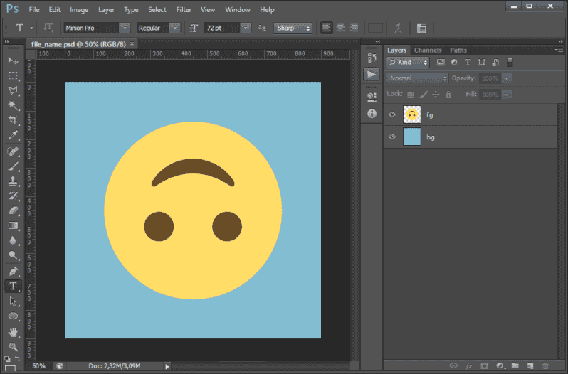

<h1 align="center">Layers to sizes</h1>

📁📁📁

 Save layers in PSD to respective PNGs files according to the config file 

<i>
Important! Tested and created for Photshop CS6 64bit Version: 13.0 on Windows 10  
</i>

## Getting Started 💡

All layers in chosen PSD are converted to PNGs with respecting sizes
Sizes are kept in config.csv in the script directory

### How config.csv works:
|      type size       |         width        |        height        |
| :------------------: | :------------------: | :------------------: |
|     folder name      |        integer       |        integer       |

### Prerequisites 💪

To run this script, you need at least **Photoshop CS6 64bit Version: 13.0** other versions of PS are not tested

### Installing 🔨

1. **Download "Blending PSD colors - toolset"**

2. **Unzip file** in a preferred directory (suggested place is: _...\Adobe\Adobe Photoshop CS6 (64 Bit)\Presets\Scripts)

3. **Open "Photoshop"**

4. Push keys: **Alt+F9**

5. Chose **"Action"** tabbed panel in the left upper corner

6. (If it is not yet) **Disable "Button mode"** by clicking an icon in the right upper corner

7. "**Create new action**" (right bottom corner of Action window)

8. **Name script** (e. g. UI toolset), optionally assign a key to it (e. g. F12) or add color (e. g. "Green")

9. Click **"ok"**

10. Choose in upper main menu: **"File -> Scripts -> Browse..."**

11. **Navigate** to the unzipped folder directory

12. **Open "blending_PSD_colors_toolset.jsx"**

13. Click **"Close"** button in UI toolset

14. Click **"Stop\playing recording"** (small grey square in the left bottom corner)

15. Enable **"Button mode"** (right upper corner)

16. Now your script is **ready to use** (Click button with your newly created action)

17. **Enjoy!**

## Running the tests 🧪

For now, only manual testing is available. Use [**Adobe Phtoshop CS6 SDK Win**](http://download.macromedia.com/pub/developer/photoshop/sdk/adobe_photoshop_cs6_sdk_win.zip) to find bugs during running script

## Built With 🧰

- [**Visual Studio Code**](https://code.visualstudio.com)
- [**Adobe Phtoshop CS6 SDK Win**](http://download.macromedia.com/pub/developer/photoshop/sdk/adobe_photoshop_cs6_sdk_win.zip)
- [**ExtendScript Debugger Extension for Visual Studio Code**](https://marketplace.visualstudio.com/items?itemName=Adobe.extendscript-debug) (mainly or debugging)

## Needed documentation 📦

- [**Photoshop CS6 Scripting Guide.pdf**](https://www.adobe.com/content/dam/acom/en/devnet/photoshop/scripting/Photoshop-CS6-Scripting-Guide.pdf)
- [**JavaScript Tools Guide CS6**](https://github.com/1179432578/psd-tool/blob/master/JavaScript%20Tools%20Guide%20CS6.pdf)
- [**Photoshop CS6 JavaScript Ref.pdf**](https://www.adobe.com/content/dam/acom/en/devnet/photoshop/scripting/Photoshop-CS6-JavaScript-Ref.pdf)

## Contributing 📬

Please read [**CONTRIBUTING.md**](docs/CONTRIBUTING.md) for details on our code of conduct, and the process for submitting pull requests to us

## Authors 🎈

- **Karol Łukaszczyk** - _Initial work_ - [**Lukkar**](https://github.com/Lukkar90)

## License 📜

This project is licensed under the MIT License - see the [**LICENSE**](LICENSE) file for details

## Acknowledgments 👍

- _README-template.md, CONTRIBUTING-template.md_ by [**PurpleBooth**](https://gist.github.com/PurpleBooth)
